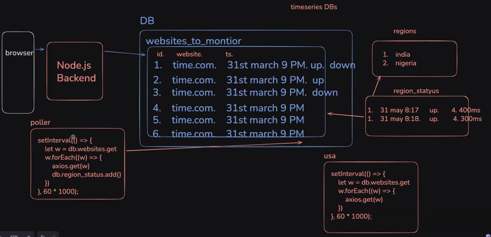
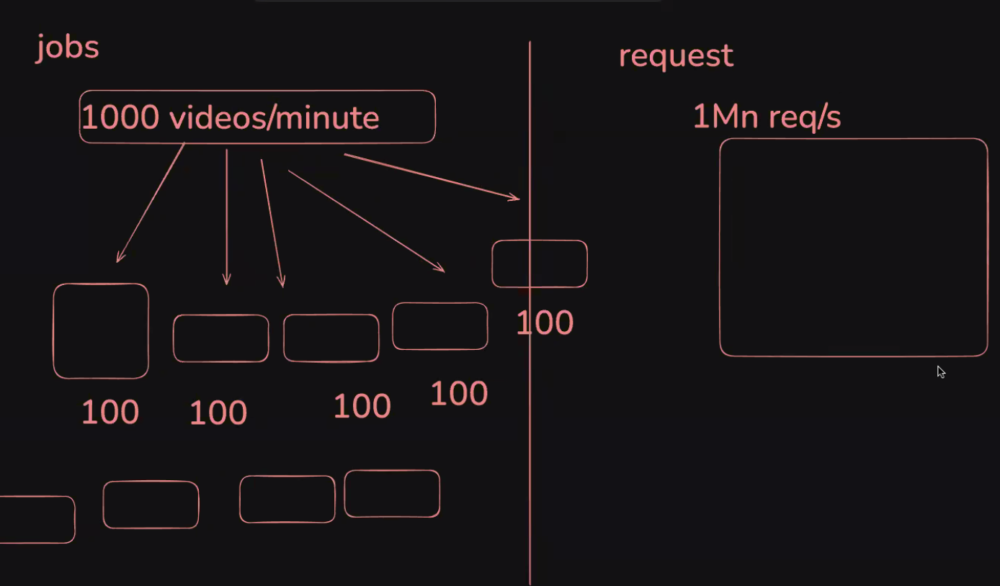
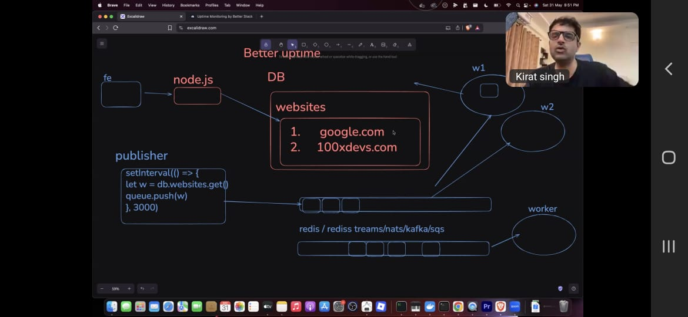

# Better Stack UpTime

# System Design





start writing the code

so basically started wrting backend in `apps/api/`
init with a express backend, stores website for now

wrote the prisma client in packages so that the db can be shared

express backend is for user auth, website CRUD and get status

db stores website, then it gets pushed to a queue via a push process
then it gets ack on the servers which are region wise located

1. We have 2 different "consumer groups"
2. Events should be distributed across all the workers of a single group
3. Our workers can go down, so we need ack (acknowledgement) based queues

push the weebsite into queue, every 3 minutes

db stores website, then it gets pushed to a queue via a push process
then it gets ack on the servers which are region wise located

1. We have 2 different "consumer groups"
2. Events should be distributed across all the workers of a single group
3. Our workers can go down, so we need ack (acknowledgement) based queues

push the weebsite into queue, every 3 minutes

start redis on docker

```sh
docker run -p -d 6379:6379 redis
```

run redis on docker, now how to test it

we use redis streams to read those website in constant time
to add on redis db:

```redis
XADD betteruptime:website * url google.com id 1
```

to read:

```redis
XREAD COUNT 10 STREAMS betteruptime:website [last_read_timestamp]
```

let's do this via node.js, first produce the stream{`producer`}, then consume it{`worker`}.

to read say 2 from one of consumer

```sh
XREADGROUP GROUP india india-1 COUNT 2 STREAMS betteruptime:website >
#consumer grp 1

XREADGROUP GROUP india india-2 COUNT 2 STREAMS betteruptime:website >
#consumer grp 2
```

now our client can read

```sh
cd worker
bun index.ts
```

pusher does what is pick all website, push to redis stream every 3 min, which fan out to
various workers present regionwise
need to create worker in packages to call anywhere
